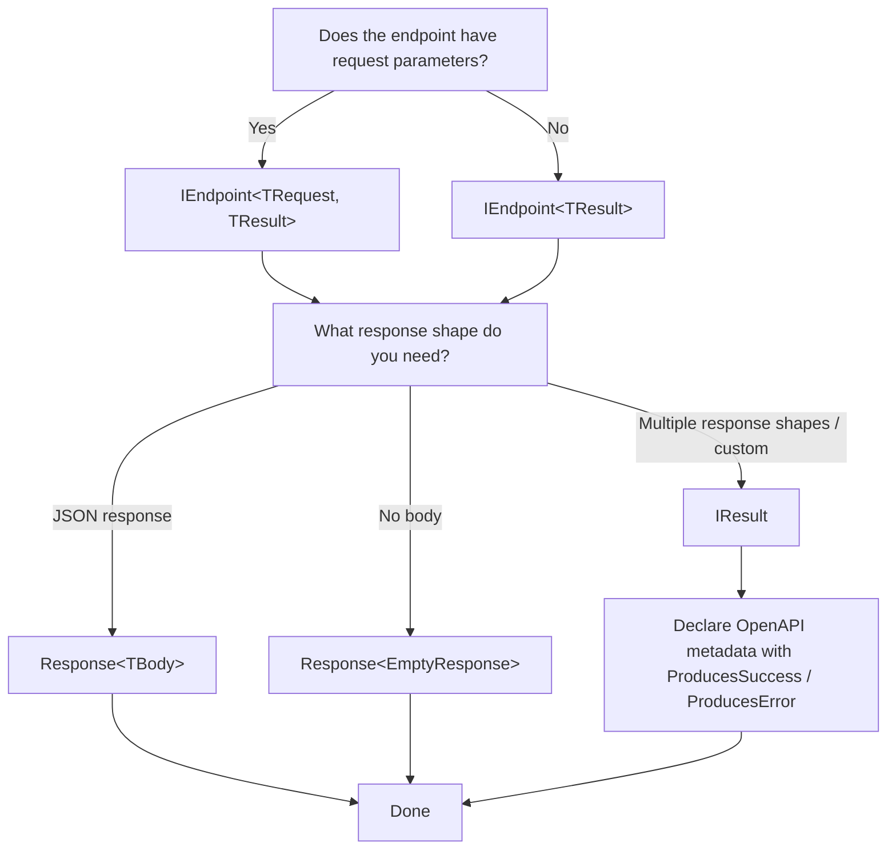

AxisEndpoints provides a thin abstraction layer on top of ASP.NET Core Minimal APIs. Understanding the following types will give you a clear picture of how the library fits together.

## Type Overview

### `IEndpoint<TRequest, TResult>` / `IEndpoint<TResult>`

These are the core interfaces for endpoint definitions. Use `Configure()` to declare routing and metadata, and `HandleAsync()` to process the request. Use `IEndpoint<TRequest, TResult>` when the endpoint has request parameters, and `IEndpoint<TResult>` when it does not.

See [Defining Endpoints](/guides/defining-endpoints/) for details.

### `IEndpointConfiguration`

This configuration interface is used inside `Configure()`. It lets you declare the HTTP method and route, OpenAPI metadata such as tags, summaries, and descriptions, authorization policies, filters, and response types.

### `Response<TBody>`

This is a wrapper type for JSON responses. It has three properties: `StatusCode` (default: 200 OK), `Headers` (optional), and `Body` (required). When used as the return type of `HandleAsync`, the 200 response schema is registered in OpenAPI automatically.

See [Response Types](/guides/response-types/) for details.

### `EmptyResponse`

This is a marker type for responses without a body. Use it as `Response<EmptyResponse>`. The `Response.Empty` (200 OK) and `Response.NoContent` (204 No Content) shorthands are available.

### `IResult`

This interface comes from ASP.NET Core Minimal APIs. It is produced by factory methods such as `Results.Json()`, `Results.Problem()`, and `Results.Ok()`. In AxisEndpoints, returning `IResult` from `HandleAsync` lets you produce multiple response shapes. When you return `IResult`, you must declare OpenAPI metadata explicitly with `ProducesSuccess<TBody>()` and `ProducesError(HttpStatusCode)`.

See [Error Responses](/guides/error-responses/) for details.

### `EndpointContext`

This class provides controlled access to the HTTP context. Inject it through the constructor to access request headers, the authenticated user, query parameters, route values, and more.

| Member | Type | Description |
| --- | --- | --- |
| `RequestHeaders` | `IHeaderDictionary` | Request headers |
| `User` | `ClaimsPrincipal` | Authenticated user |
| `Query` | `IQueryCollection` | Query string |
| `GetRouteValue(key)` | `string?` | Route parameter |
| `RawResponse` | `HttpResponse` | Direct access to the response stream |

See [HTTP Context](/guides/http-context/) for details.

### `IEndpointGroup` / `IEndpointGroupConfiguration`

This mechanism allows multiple endpoints to share a common route prefix, tags, authorization policies, and filters. Implement `IEndpointGroup` to define a group and reference it from endpoints with `config.Group<TGroup>()`.

See [Endpoint Groups](/guides/endpoint-groups/) for details.

### `IEndpointFilter`

This filter interface comes from ASP.NET Core Minimal APIs. It lets you run logic before or after the request reaches the handler. Unlike middleware, filters can be scoped to specific endpoints or groups. In AxisEndpoints, register them with `config.AddFilter<TFilter>()`, and they are resolved from the DI container.

See [Filters](/guides/filters/) for details.

### `ProblemDetails`

This is ASP.NET Core's `Microsoft.AspNetCore.Mvc.ProblemDetails` type, the standard error response format defined by RFC 9457 (formerly RFC 7807).

Common fields:

| Field | Description |
| --- | --- |
| `type` | URI that identifies the error category |
| `title` | Short summary of the error |
| `status` | HTTP status code |
| `detail` | Detailed explanation of the error |
| `errors` | Additional details such as validation errors |

Use this format to return consistent error information to clients when an API request fails. AxisEndpoints' DataAnnotations validation filter also returns errors in this format. When you use `ProducesError(HttpStatusCode)`, `ProblemDetails` is registered automatically as the error response type in OpenAPI.

See [Error Responses](/guides/error-responses/) for details.

---

## Which Type Should I Use?

Use the following flowchart to decide which type to choose when designing an endpoint.

## Notes on ASP.NET Core Standard Types

AxisEndpoints builds directly on ASP.NET Core standard types. The types below are not AxisEndpoints-specific, so standard Minimal API knowledge applies as-is.

### `IResult`

This interface is provided by ASP.NET Core Minimal APIs and represents an HTTP response. It is produced by factory methods such as `Results.Json()`, `Results.Problem()`, `Results.Ok()`, and `Results.NotFound()`. In AxisEndpoints, specifying `IResult` as the return type of `HandleAsync` lets you return different response shapes based on the outcome, such as JSON on success and `ProblemDetails` on error.

> [IResult - Microsoft docs](https://learn.microsoft.com/en-us/dotnet/api/microsoft.aspnetcore.http.iresult) 

### `ProblemDetails`

`Microsoft.AspNetCore.Mvc.ProblemDetails` provides the standard error response format defined by RFC 9457 (formerly RFC 7807). It includes fields such as `type`, `title`, `status`, `detail`, and `errors`, which bring consistency to API error responses. AxisEndpoints' DataAnnotations validation filter also returns validation errors in this format.

>  [ProblemDetails - Microsoft docs](https://learn.microsoft.com/en-us/dotnet/api/microsoft.aspnetcore.mvc.problemdetails)

### `IEndpointFilter`

This filter interface is provided by ASP.NET Core Minimal APIs and lets you insert logic into the request pipeline. Unlike middleware, it can be scoped to specific endpoints or groups, which gives you finer control over cross-cutting concerns.

> [IEndpointFilter - Microsoft docs](https://learn.microsoft.com/en-us/dotnet/api/microsoft.aspnetcore.http.iendpointfilter) 
