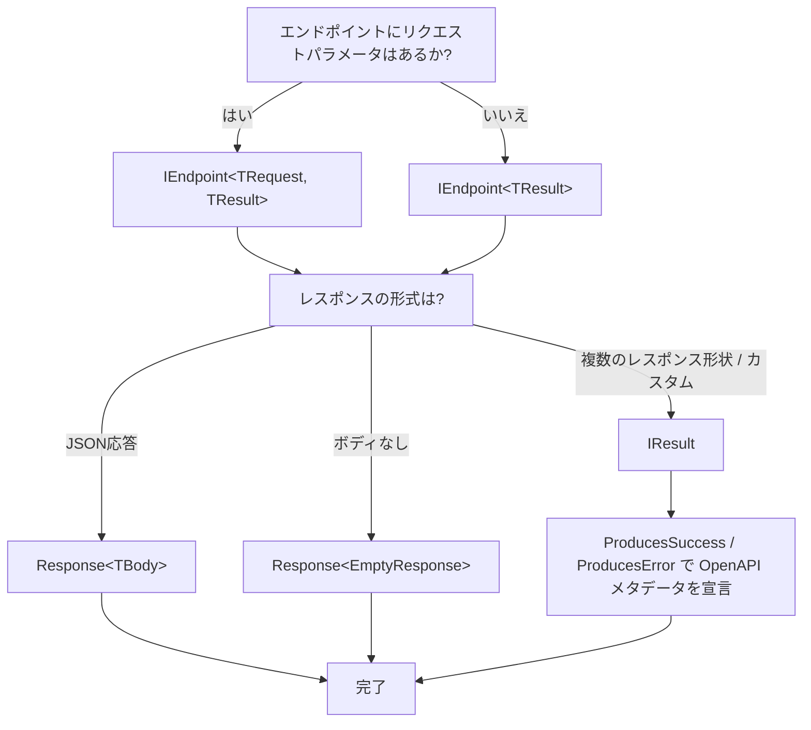
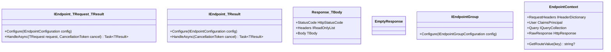

AxisEndpoints は、ASP.NET Core Minimal API の上に薄い抽象化レイヤーを提供します。以下の型を理解することで、ライブラリの全体像を把握できます。

## 型の一覧

### `IEndpoint<TRequest, TResult>` / `IEndpoint<TResult>`

エンドポイント定義の中核となるインタフェースです。`Configure()` でルーティングやメタデータを宣言し、`HandleAsync()` でリクエストを処理します。リクエストパラメータがある場合は `IEndpoint<TRequest, TResult>` を、パラメータなしの場合は `IEndpoint<TResult>` を使います。

詳しくは [Defining Endpoints](/guides/defining-endpoints/) を参照してください。

### `IEndpointConfiguration`

`Configure()` メソッド内で使用する設定インタフェースです。HTTP メソッドとルートの指定、OpenAPI メタデータ（タグ、サマリー、説明）、認可ポリシー、フィルタ、レスポンス型の宣言を行います。

### `Response<TBody>`

JSON 応答のラッパー型です。`StatusCode`（デフォルト: 200 OK）、`Headers`（オプション）、`Body`（必須）の3つのプロパティを持ちます。`HandleAsync` の戻り値として使用すると、200 のスキーマが OpenAPI に自動登録されます。

詳しくは [Response Types](/guides/response-types/) を参照してください。

### `EmptyResponse`

ボディなし応答のマーカー型です。`Response<EmptyResponse>` として使用します。`Response.Empty`（200 OK）と `Response.NoContent`（204 No Content）のショートハンドが用意されています。

### `IResult`

ASP.NET Core Minimal API が提供するインタフェースです。`Results.Json()`, `Results.Problem()`, `Results.Ok()` などのファクトリメソッドで生成します。AxisEndpoints では `HandleAsync` の戻り値として使うことで、複数のレスポンス形状を返せます。`IResult` を返す場合は `ProducesSuccess<TBody>()` と `ProducesError(HttpStatusCode)` で OpenAPI メタデータを明示的に宣言する必要があります。

詳しくは [Error Responses](/guides/error-responses/) を参照してください。

### `EndpointContext`

HTTP コンテキストへの制御されたアクセスを提供するクラスです。コンストラクタインジェクションで取得し、リクエストヘッダー、認証ユーザー、クエリパラメータ、ルート値などにアクセスできます。

| メンバー | 型 | 説明 |
| --- | --- | --- |
| `RequestHeaders` | `IHeaderDictionary` | リクエストヘッダー |
| `User` | `ClaimsPrincipal` | 認証済みユーザー |
| `Query` | `IQueryCollection` | クエリ文字列 |
| `GetRouteValue(key)` | `string?` | ルートパラメータ |
| `RawResponse` | `HttpResponse` | レスポンスストリームへの直接アクセス |

詳しくは [HTTP Context](/guides/http-context/) を参照してください。

### `IEndpointGroup` / `IEndpointGroupConfiguration`

複数のエンドポイントが共通のルートプレフィックス、タグ、認可ポリシー、フィルタを共有するための仕組みです。`IEndpointGroup` を実装してグループを定義し、エンドポイント側から `config.Group<TGroup>()` で参照します。

詳しくは [Endpoint Groups](/guides/endpoint-groups/) を参照してください。

### `IEndpointFilter`

ASP.NET Core Minimal API が提供するフィルタインタフェースです。リクエストパイプラインの途中で処理を挟むことができます。ミドルウェアと異なり、特定のエンドポイントやグループにスコープを限定できます。AxisEndpoints では `config.AddFilter<TFilter>()` で登録し、DI コンテナから解決されます。

詳しくは [Filters](/guides/filters/) を参照してください。

### `ProblemDetails`

ASP.NET Core の `Microsoft.AspNetCore.Mvc.ProblemDetails` クラスで、RFC 9457（旧 RFC 7807）に準拠したエラーレスポンスの標準形式です。

主なフィールド:

| フィールド | 説明 |
| --- | --- |
| `type` | エラー種別を識別する URI |
| `title` | エラーの短い要約 |
| `status` | HTTP ステータスコード |
| `detail` | エラーの詳細な説明 |
| `errors` | バリデーションエラーなどの追加情報 |

API でエラーが発生した際に一貫した形式でクライアントにエラー情報を返すために使用します。AxisEndpoints の DataAnnotations バリデーションフィルタもこの形式でエラーを返します。`ProducesError(HttpStatusCode)` を使うと、OpenAPI ドキュメントに `ProblemDetails` がエラーレスポンスの型として自動的に登録されます。

詳しくは [Error Responses](/guides/error-responses/) を参照してください。

---

## どの型を使うべきか

以下のフローチャートで、エンドポイントの設計時にどの型を選ぶか判断できます。

---

## 型の関係

以下のクラス図は、主要な型がどのように関連しているかを示します。

---

## ASP.NET Core 標準型の補足

AxisEndpoints は ASP.NET Core の標準型をそのまま活用しています。以下の型は AxisEndpoints 固有のものではなく、ASP.NET Core Minimal API の知識がそのまま適用できます。

### `IResult`

ASP.NET Core Minimal API が提供するインタフェースで、HTTP レスポンスを表現します。`Results.Json()`, `Results.Problem()`, `Results.Ok()`, `Results.NotFound()` などのファクトリメソッドで生成します。AxisEndpoints では `HandleAsync` の戻り値の型として `IResult` を指定することで、条件に応じて異なるレスポンス形状（成功時は JSON、エラー時は `ProblemDetails` など）を返すことができます。

### `ProblemDetails`

`Microsoft.AspNetCore.Mvc.ProblemDetails` クラスは、RFC 9457（旧 RFC 7807）に準拠したエラーレスポンスの標準形式を提供します。`type`, `title`, `status`, `detail`, `errors` などのフィールドを持ち、API のエラーレスポンスに一貫性をもたらします。AxisEndpoints の DataAnnotations バリデーションフィルタもこの形式でバリデーションエラーを返します。

### `IEndpointFilter`

ASP.NET Core Minimal API が提供するフィルタインタフェースで、リクエストパイプラインの途中で処理を挟むことができます。ミドルウェアと異なり、特定のエンドポイントやグループにスコープを限定できるため、横断的関心事をきめ細かく制御できます。
