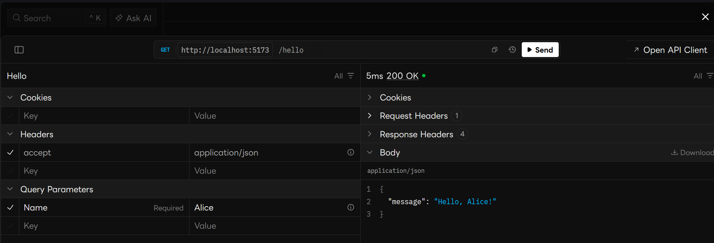

# AxisEndpoints Quick Tutorial

This project is a quick tutorial for trying out AxisEndpoints. 

## Requirements

.NET SDK 10.0 or later is required to run this project. You can download it from the official .NET website: 

> [Download .NET SDK](https://dotnet.microsoft.com/download)

## Getting Started

First, create a new ASP.NET Core Web API project and add the AxisEndpoints package:

```sh
# Create a new directory and navigate into it
mkdir AxisEndpoints.Tutorial
cd AxisEndpoints.Tutorial

# Create a new ASP.NET Core Web API project
dotnet new webapi

# Add the AxisEndpoints package
dotnet add package AxisEndpoints
```

Next, if you want to use the Scalar API reference, add the `Scalar.AspNetCore` package:

```sh
# Add the Scalar.AspNetCore package (optional)
dotnet add package Scalar.AspNetCore
```

Then, configure the application to use AxisEndpoints in `Program.cs`:

Next, create a new endpoint by adding a new class `HelloEndpoint.cs` in the `Features/Hello` directory:


To run the application, execute `dotnet run` in the terminal.

Scalar API reference is available at `http://localhost:{port}/scalar` after running the application.

